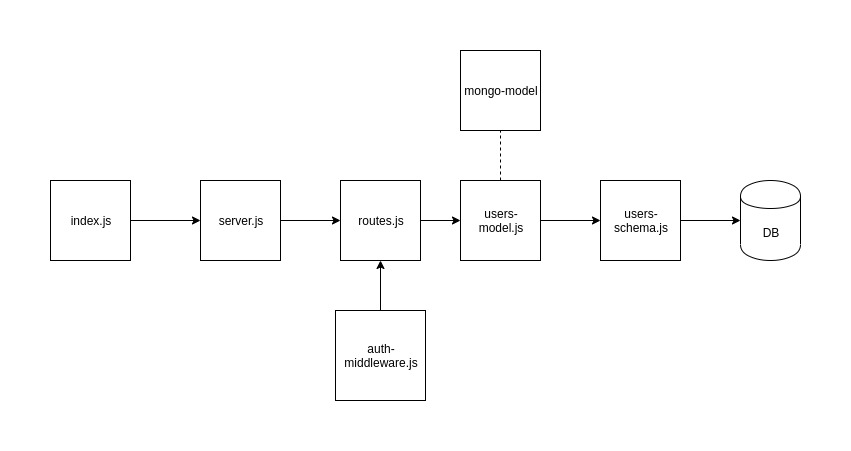

# LAB - 401-lab-11

## Authentication

### Author: Travis Skyles

### Links and Resources
* [submission PR](https://github.com/tskyles-401-advanced-javascript/401-lab-11/pull/1)
* [travis](https://travis-ci.com/tskyles-401-advanced-javascript/401-lab-11)
* [back-end](https://tskyles-lab-11.herokuapp.com/)
* [mongo-model npm](https://www.npmjs.com/package/@tskyles/mongo-model)

#### Documentation
* [api docs](https://tskyles-lab-11.herokuapp.com/api-docs/)
* [jsdocs](https://tskyles-lab-11.herokuapp.com/docs/)

### Setup
* clone repo
* npm init -y
* npm install

#### `.env` requirements
* `PORT` - Port Number
* `MONGODB_URI` - URL to the running mongo instance/db

#### How to initialize/run your server app (where applicable)
* Start App: `npm start`
* Endpoint: /api-docs
  * Returns api-documentation
* Endpoint: /docs
  * Returns JSdocs

  
#### Tests
* Unit Tests: `npm test`
* Eslint: `npm run lint`

#### UML
